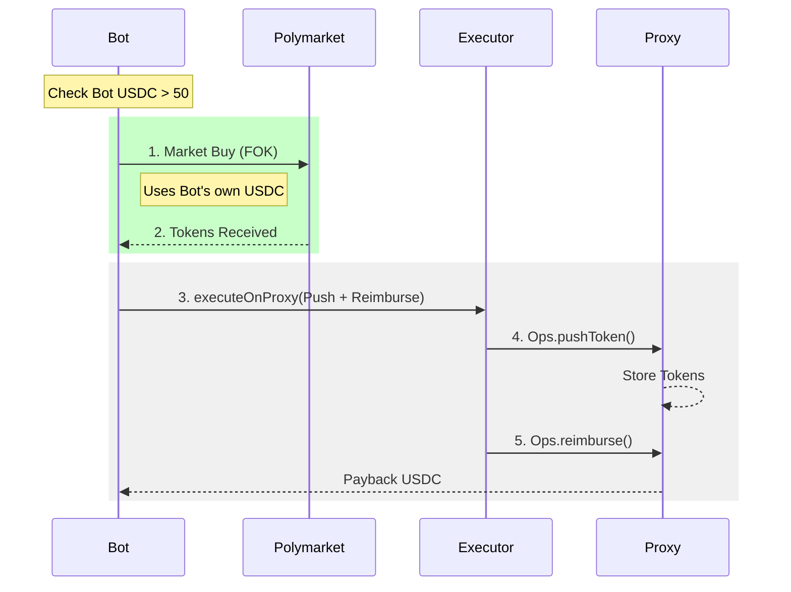
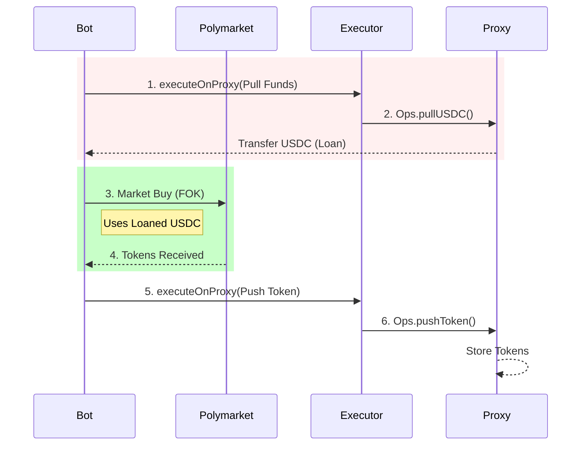

# 交易流程详解 (Trading Process)

> **Last Updated**: 2026-02-05  
> **Applicable Version**: PolyHunter v2.1 (Smart Buffer Supported)

## 1. 核心概念 (Core Concepts)

系统的核心在于 **Proxy (用户资金池)** 与 **Bot (无状态执行器)** 的分离。

*   **Proxy**: 用户的 100% 资金和头寸永远存放在这里。
*   **Bot**: 只负责搬运。它是一个 "Stateless Runner"。
*   **Smart Buffer**: 为了提速，允许 Bot 暂时垫付资金 (Float)，事后报销。

---

## 2. 两种执行模式 (Execution Modes)

Worker 会根据自身的 `USDC Balance` 自动动态选择最优路径。

### 🚀 Mode A: Smart Buffer (极速模式)
当 Bot 钱包有余额 (> 50 USDC) 时自动激活。这是 **推荐** 的生产环境配置。
*   **优势**: 减少 1 笔链上交易 (Pull)，速度等同于 EOA 直连。
*   **流程**: `Trade (垫资)` -> `Push (归仓)` -> `Reimburse (报销)`

### 🐢 Mode B: Standard Pull (标准模式/回退)
当 Bot 余额不足时退化到此模式。
*   **优势**: Bot 不需要持有资金，极度安全。
*   **劣势**: 每次交易前必须先上链“借钱”，慢约 2-3 秒。
*   **流程**: `Pull (借钱)` -> `Trade (买入)` -> `Push (归仓)`

---

## 3. 详细时序图 (Sequence Diagrams)

### Scenario 1: Smart Buffer BUY (Fastest)

Bot 直接用自己的钱买入，然后找 Proxy 报销。

### Scenario 2: Standard LEVERAGED BUY (Fallback)

Bot 没钱，必须先让 Proxy 把钱打过来。

---

## 4. 关键合约鉴权 (Authorization)

所有操作都依赖于 **Executor** 的白名单机制。

1.  **Proxy -> Executor**: 用户必须先调用 `proxy.approveExecutor(executorAddress)`。
    *   这赋予了 Executor 指挥 Proxy 资金的权利。
2.  **Executor -> Bot**: 部署者在 Executor 合约中设置 `setWorkerStatus(botAddress, true)`。
    *   这允许 Bot 指挥 Executor。

**调用链**:
`Bot (Signer)` -> `Executor Contract` -> `Proxy Contract (msg.sender)` -> `USDC/CTF Contract`

## 5. 异常处理 (Error Handling)

如果在 **Smart Buffer** 模式下，Step 3 (Reimbursement) 失败怎么办？
*   **现状**: Bot 持有 Token (但其实它是想换回 USDC)，且损失了现金。
*   **DebtManager**: 系统会记录一笔 `Pending Debt`。
*   **Recovery**: 后台进程 (`recoverPendingDebts`) 会不断尝试重发 Step 3，直到 Proxy 把钱还给 Bot。