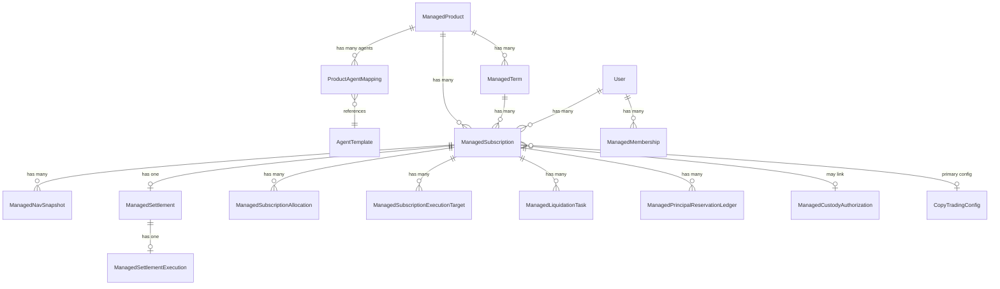
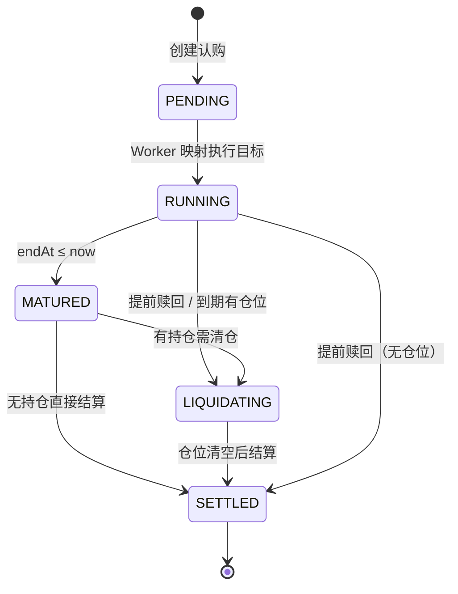
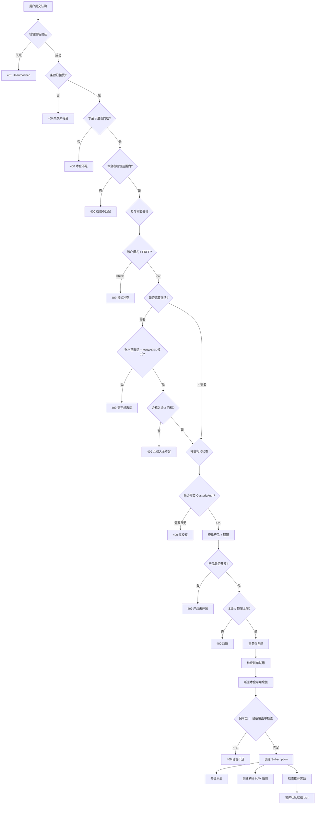

# Managed Wealth (托管理财) — 产品需求文档 (PRD)

> **版本**: 1.0 · **日期**: 2026-03-02 · **基于代码库实际实现分析**

---

## 1. 产品概述

**Managed Wealth（托管理财）** 是 Poly-Hunter 平台的核心增值模块，提供**全托管式**预测市场投资服务。用户将资金委托给系统，系统基于策略配置自动跟单执行交易（通过 Polymarket CLOB 协议），并在到期后按约定规则进行清算和结算。

### 1.1 核心价值主张

| 维度 | 描述 |
|------|------|
| 🛡️ 本金保障 | 保本型产品通过储备金池（Reserve Fund）提供最低收益保证 |
| 📊 透明净值 | 实时 NAV（Net Asset Value）快照，按分钟级 Mark-to-Market 估值 |
| 🤖 自动化执行 | 基于 Leaderboard + Smart Money 的智能分配，自动跟单交易 |
| 🔐 钱包签名鉴权 | 全链路钱包签名验证，确保资金操作安全 |

### 1.2 用户角色

| 角色 | 权限 |
|------|------|
| **投资者 (Subscriber)** | 浏览产品、认购、查看仪表板、提前赎回、购买会员 |
| **系统管理员 (Admin)** | 配置产品/期限、管理储备金、监控结算健康度 |
| **后台 Worker** | 自动执行 NAV 刷新、到期标记、清仓、结算 |

---

## 2. 产品体系架构

### 2.1 核心实体关系



### 2.2 ManagedProduct（托管产品）

每个产品代表一种投资策略配置文件：

| 字段 | 说明 |
|------|------|
| `slug` | URL 友好标识符 |
| `name` / `description` | 产品名称 / 描述 |
| `strategyProfile` | 策略风格：`CONSERVATIVE` / `MODERATE` / `AGGRESSIVE` |
| `isGuaranteed` | 是否为保本型产品 |
| `disclosurePolicy` | 持仓披露策略：`TRANSPARENT`（实时）/ `DELAYED`（延迟） |
| `disclosureDelayHours` | 延迟披露小时数 |
| `performanceFeeRate` | 默认绩效费率 |
| `reserveCoverageMin` | 保本型产品的最低储备覆盖率 |
| `isActive` / `status` | 是否激活 / `ACTIVE` or `PAUSED` |

**策略风格规则**（用于 Allocation 引擎的候选人筛选阈值）：

| 策略 | 最低分数 | 最低跟单友好度 | 最大回撤率 | 最低近期交易数 | UI主题色 |
|------|---------|--------------|-----------|-------------|---------|
| CONSERVATIVE | 65 | 60 | 22% | 4 | 🟢 绿色 |
| MODERATE | 55 | 50 | 38% | 3 | 🔵 蓝色 |
| AGGRESSIVE | 45 | 40 | 60% | 1 | 🟣 紫色 |

### 2.3 ManagedTerm（投资期限）

每个产品可配置多个投资期限：

| 字段 | 说明 |
|------|------|
| `durationDays` | 期限天数（标准周期：`7, 30, 90, 180, 360`） |
| `targetReturnMin` / `targetReturnMax` | 目标收益率范围 |
| `maxDrawdown` | 最大回撤限制 |
| `minYieldRate` | 保本型产品的最低保证收益率 |
| `performanceFeeRate` | 期限级绩效费率（覆盖产品级） |
| `maxSubscriptionAmount` | 单笔认购上限 |

### 2.4 本金档位系统（Principal Band）

用户认购时需选择本金档位，影响收益预期区间：

| 档位 | 本金范围 (USDC) | 说明 |
|------|----------------|------|
| **A** | $500 – $5,000 | 入门级 |
| **B** | $5,001 – $50,000 | 进阶级 |
| **C** | $50,001 – $300,000 | 高净值级 |

最低认购门槛：`$500`（通过 `PARTICIPATION_MANAGED_MIN_PRINCIPAL_USD` 环境变量配置）

---

## 3. 认购生命周期（Subscription Lifecycle）

### 3.1 状态机



### 3.2 认购创建流程（POST /api/managed-subscriptions）



### 3.3 认购创建关键规则

1. **事务锁**：使用 `pg_advisory_xact_lock` 防止并发试用/本金预留冲突
2. **试用机制**：首次认购 + 1天期限 = 试用单（`isTrial = true`），试用期内绩效费率为 0
3. **推荐奖励**：首单自动检查是否有一次性推荐订阅奖励
4. **初始 NAV**：`nav = 1, equity = principal, cumulativeReturn = 0`
5. **本金预留**：从用户合格入金余额中预留对应金额

---

## 4. 自动执行引擎

### 4.1 Allocation Service（分配服务）

Worker 为每个认购自动分配跟单目标交易员：

**候选人来源**：
- **Leaderboard**（排行榜数据）：评分、跟单友好度、回撤率、近期交易数
- **Smart Money**（聪明钱发现服务）：链上行为分析
- **Product Template**（预设模板）：产品配置的默认 Agent 映射

**评分公式**：
```
compositeScore = baseScore × qualityWeight × activityWeight × drawdownWeight × sourceBonus
```

| 因子 | 权重范围 | 说明 |
|------|---------|------|
| `baseScore` | 0–100 | 来源加权平均分 |
| `qualityWeight` | 0–1 | 数据质量权重（full=1, limited=0.88, insufficient=0） |
| `activityWeight` | 0.9–1.2 | 活跃度加成 |
| `drawdownWeight` | 0.3–1 | 低回撤加成 |
| `sourceBonus` | 1 or 1.05 | 多来源交叉验证加分 |

**目标选择**：使用**确定性种子随机**（Seeded RNG）基于 `subscriptionId + walletAddress + strategyProfile + version` 生成加权随机组合。

**Allocation Snapshot 生命周期**：
1. `ACTIVE` → 当前生效的分配方案
2. `SUPERSEDED` → 被新版本替代

### 4.2 Execution Target Mapping（执行目标映射）

Worker（`managed-wealth-worker.ts`）每个 cycle 的 Step 1：

1. 遍历所有 PENDING/RUNNING 状态的认购
2. 基于产品 Agent 模板或现有分配方案，解析出目标交易员列表
3. 为每个目标创建或更新 `CopyTradingConfig`（跟单配置）
4. 维护 `ManagedSubscriptionExecutionTarget` 表，支持多目标加权执行
5. 配置参数：
   - `fixedAmount = principal × 0.1 × weight`
   - `maxSizePerTrade = principal × 0.2 × weight`
   - `mode = FIXED_AMOUNT`, `channel = EVENT_LISTENER`, `executionMode = PROXY`

---

## 5. NAV 净值管理

### 5.1 Mark-to-Market 估值

Worker 每 cycle 的 `refreshNavSnapshots` 阶段：

```
equity = principal + realizedPnl + unrealizedPnl
nav = equity / principal
periodReturn = (equity - prevEquity) / prevEquity
cumulativeReturn = (equity - principal) / principal
drawdown = (peakNav - nav) / peakNav
```

**数据来源**：
- `realizedPnl`：从 `CopyTrade` 表聚合（status = EXECUTED）
- `unrealizedPnl`：遍历持仓，获取 CLOB ORderbook 最佳买价 Mark-to-Market
- `highWaterMark`：全局最高权益，用于绩效费计算

### 5.2 NAV Snapshot 字段

| 字段 | 说明 |
|------|------|
| `snapshotAt` | 快照时间（按分钟对齐） |
| `nav` | 净值（equity/principal） |
| `equity` | 当前权益 |
| `periodReturn` | 期间收益率 |
| `cumulativeReturn` | 累计收益率 |
| `drawdown` | 当前回撤 |
| `volatility` | 波动率 |
| `priceSource` | `INITIAL` / `MARK_TO_MARKET` |

---

## 6. 到期与结算（Settlement）

### 6.1 Worker 生命周期管理

| 阶段 | 函数 | 说明 |
|------|------|------|
| 1 | `ensureExecutionMappings` | 为新认购创建跟单配置和执行目标 |
| 2 | `markMaturedSubscriptions` | `RUNNING` + `endAt ≤ now` → `MATURED` |
| 3 | `settleMaturedSubscriptions` | 到期认购：有仓位→LIQUIDATING，无仓位→结算 |
| 4 | `liquidateSubscriptions` | 为 LIQUIDATING 的认购创建清仓任务 |
| 5 | `refreshNavSnapshots` | 刷新 RUNNING/LIQUIDATING 的 NAV |
| 6 | `enforceGuaranteedPause` | 检查储备覆盖率，不足时暂停保本产品 |

### 6.2 Settlement Math（结算数学）

```
grossPnl = finalEquity - principal
hwmEligibleProfit = max(0, finalEquity - highWaterMark)
performanceFee = hwmEligibleProfit × performanceFeeRate
preGuaranteePayout = principal + grossPnl - performanceFee
```

**保本型产品额外逻辑**：
```
guaranteedPayout = principal × (1 + minYieldRate)
reserveTopup = max(0, guaranteedPayout - preGuaranteePayout)
finalPayout = preGuaranteePayout + reserveTopup
```

> [!IMPORTANT]
> 绩效费基于 **High Water Mark (HWM)** 机制，只对超过历史最高权益的部分收取，防止用户在亏损恢复过程中被重复收费。

### 6.3 试用期零费率

- 条件：首次认购 + 1天期限
- 效果：`performanceFeeRate = 0`（仅在 `endAt ≤ trialEndsAt` 时生效）

### 6.4 佣金分发（Commission Settlement）

结算完成后，如果有正向利润（`grossPnl > 0`）：

1. 创建 `ManagedSettlementExecution` 记录
2. 状态机：`PENDING → PROCESSING → COMPLETED / FAILED`
3. 通过 `affiliateEngine.distributeProfitFee` 分发给推荐人/联盟合作伙伴
4. 幂等设计：使用 `settlementId` 防止重复分发

---

## 7. 清仓机制（Liquidation）

### 7.1 两阶段清仓

**阶段 1：任务创建**（`managed-wealth-worker.ts`）
- 发现 LIQUIDATING 状态的认购
- 查找其持仓（优先 scoped positions，回退 legacy user positions）
- 获取 CLOB Orderbook 最佳买价
- 创建 `ManagedLiquidationTask`

**阶段 2：任务执行**（`managed-liquidation-worker.ts`）
- 独立 Worker 进程，批量抢占待执行任务
- 通过 `CopyTradingExecutionService` 执行卖单
- 成功后更新持仓和交易记录
- 失败时指数退避重试（base 120s → max 30min）

### 7.2 Liquidation Intent 状态

| 状态 | 条件 | 说明 |
|------|------|------|
| `PENDING` | 有 CopyConfig + 有买盘流动性 | 等待执行 |
| `RETRYING` | 有 CopyConfig + 无买盘流动性 | 等待流动性恢复 |
| `BLOCKED` | 无 CopyConfig | 需要人工介入 |

---

## 8. 提前赎回（Early Withdrawal）

### 8.1 赎回规则

| 护栏参数 | 默认值 | 可配置范围 | 说明 |
|---------|--------|-----------|------|
| `cooldownHours` | 6h | 0–168h | 认购后冷静期 |
| `earlyWithdrawalFeeRate` | 1% | 0–50% | 提前赎回罚金 |
| `drawdownAlertThreshold` | 35% | 0–100% | 回撤预警阈值 |

### 8.2 赎回流程

1. 用户在 Dashboard 点击赎回
2. 前端检查是否需要确认提前赎回费用
3. 调用 `PUT /api/managed-subscriptions/[id]`（需签名验证）
4. 后端执行结算 → 有仓位则先进入 LIQUIDATING → 清仓完成后结算
5. 释放本金预留（`releaseManagedPrincipalReservation`）

---

## 9. 本金预留系统（Principal Reservation）

### 9.1 余额计算

```
managedQualifiedBalance = Σ deposits.mcnEquivalent - Σ withdrawals.mcnEquivalent
reservedBalance = max(ledger_based_reserved, active_subscription_principal_sum)
availableBalance = managedQualifiedBalance - reservedBalance
```

### 9.2 操作类型

| 操作 | 时机 | 说明 |
|------|------|------|
| `RESERVE` | 认购创建 | 预留本金，减少可用余额 |
| `RELEASE` | 结算完成 | 释放预留，恢复可用余额 |

> [!NOTE]
> 使用幂等键 `managed-reservation:{reserve|release}:{subscriptionId}` 防止重复操作。

---

## 10. 储备金池（Reserve Fund）

### 10.1 账本类型

| 类型 | 方向 | 说明 |
|------|------|------|
| `DEPOSIT` | + | 储备金注入 |
| `WITHDRAW` | - | 储备金提取 |
| `GUARANTEE_TOPUP` | - | 保本赔付支出 |
| `ADJUSTMENT` | + | 调整条目 |

### 10.2 覆盖率机制

```
guaranteedLiability = Σ (principal × minYieldRate)  // 所有活跃保本型认购
coverageRatio = reserveBalance / guaranteedLiability
```

- 认购时：`coverageRatio < product.reserveCoverageMin` → 拒绝新认购
- Worker 检查：`coverageRatio < reserveCoverageMin` → 暂停产品（`PAUSED`），恢复后自动重新激活

---

## 11. 会员体系（Membership）

### 11.1 会员计划

| 计划 | 时长 | 基础价格 | MCN 折扣 | MCN 价格 |
|------|------|---------|---------|---------|
| **月卡** (MONTHLY) | 30天 | $88 | 50% | $44 |
| **季卡** (QUARTERLY) | 90天 | $228 | 50% | $114 |

### 11.2 会员状态

| 状态 | 说明 |
|------|------|
| `ACTIVE` | 有效期内 |
| `EXPIRED` | 已过期（自动标记） |
| `CANCELLED` | 已取消 |

### 11.3 业务规则

- 同一钱包同时只能有 **1个** ACTIVE 会员
- 过期自动标记：每次 GET 请求时会先执行 `expireOutdatedMemberships`
- 支持双币种支付：USDC（原价）/ MCN（5折）
- 即将到期预警：剩余 3 天以内显示提醒
- 购买需要钱包签名鉴权

---

## 12. 安全与鉴权

### 12.1 Wallet Auth —— 签名验证体系

所有写操作和敏感读操作都需要 MetaMask 签名验证：

**请求头**：
| Header | 说明 |
|--------|------|
| `x-managed-wallet` | 钱包地址 |
| `x-managed-timestamp` | 时间戳 |
| `x-managed-signature` | 签名值 |

**签名消息格式**：
```
Poly-Hunter Managed Wealth Auth
Wallet: {address}
Method: {GET|POST|PUT|DELETE}
Path: {path}
Timestamp: {timestamp}
```

### 12.2 Session Signature Cache

- GET 请求使用 5 分钟 Session 签名缓存
- POST/PUT/DELETE 每次请求需要独立签名
- 目的：减少 MetaMask 弹窗次数，提升用户体验

### 12.3 Custody Authorization

可选的托管授权流程（`REQUIRE_CUSTODY_AUTH` 策略门控）：
- 用户需显式授予 MANAGED 模式的托管授权
- 每个认购关联一个 CustodyAuthorization 记录

---

## 13. 收益预测矩阵

### 13.1 Return Matrix

前端市场页面展示收益预测矩阵，根据以下维度查询：

| 维度 | 选项 |
|------|------|
| 本金档位 | A / B / C |
| 投资周期 | 7 / 30 / 90 / 180 / 360 天 |
| 策略风格 | CONSERVATIVE / MODERATE / AGGRESSIVE |

数据来源自 `/api/participation/rules` 端点（`managedReturnMatrix`），展示预期收益区间。

---

## 14. 前端页面架构

### 14.1 页面路由

| 路由 | 页面 | 说明 |
|------|------|------|
| `/managed-wealth` | Marketplace | 产品市场页：浏览策略产品、查看收益矩阵 |
| `/managed-wealth/[id]` | Product Detail | 产品详情页：查看条款、执行认购 |
| `/managed-wealth/my` | Dashboard | 用户仪表板：持仓总览、统计、交易历史、会员管理 |
| `/managed-wealth/membership` | Membership | 会员历史记录 |
| `/dashboard/admin/managed-wealth` | Admin | 管理后台 |

### 14.2 核心 UI 组件

| 组件 | 文件 | 功能 |
|------|------|------|
| `ManagedProductCard` | `managed-product-card.tsx` | 产品卡片：策略标签、收益预期、认购入口 |
| `SubscriptionModal` | `subscription-modal.tsx` | 认购弹窗：选期限、输入本金、确认条款 |
| `ManagedSubscriptionItem` | `managed-subscription-item.tsx` | 持仓卡片：NAV图表、PnL、提前赎回、分配详情 |
| `ManagedStatsGrid` | `managed-stats-grid.tsx` | 总览统计网格（总本金、总权益、总PnL） |
| `ManagedNavChart` | `managed-nav-chart.tsx` | NAV 净值走势图 |
| `ManagedTransactionHistory` | `managed-transaction-history.tsx` | 交易流水列表 |

---

## 15. 后台 Worker 架构

### 15.1 managed-wealth-worker

| 配置 | 默认值 | 说明 |
|------|--------|------|
| 循环间隔 | 60s | `MANAGED_WEALTH_LOOP_INTERVAL_MS` |
| 运行模式 | 循环 | `MANAGED_WEALTH_RUN_ONCE` 支持单次执行 |
| NAV 批次 | 50 | `MANAGED_NAV_BATCH_SIZE` |
| 结算批次 | 20 | `MANAGED_SETTLEMENT_BATCH_SIZE` |

**每个 Cycle 6 步顺序执行**：

1. **`ensureExecutionMappings`** → 分配跟单目标
2. **`markMaturedSubscriptions`** → 标记到期
3. **`settleMaturedSubscriptions`** → 结算（或转 LIQUIDATING）
4. **`liquidateSubscriptions`** → 创建清仓任务
5. **`refreshNavSnapshots`** → 刷新 NAV
6. **`enforceGuaranteedPause`** → 储备覆盖率检查

### 15.2 managed-liquidation-worker

独立进程，专门执行清仓卖单：
- 批量抢占 `ManagedLiquidationTask`（使用 processing lease 机制）
- 通过 CLOB 协议执行市价卖单
- 指数退避重试机制（120s base → 30min max）
- 成功后更新持仓、记录交易

---

## 16. API 接口清单

| Method | Path | Auth | 说明 |
|--------|------|------|------|
| `GET` | `/api/managed-products` | 公开 | 查询活跃产品列表 |
| `GET` | `/api/managed-products/[id]` | 公开 | 产品详情 |
| `GET` | `/api/managed-subscriptions` | 签名 | 查询用户持仓列表 |
| `POST` | `/api/managed-subscriptions` | 签名 | 创建新认购 |
| `GET` | `/api/managed-subscriptions/[id]` | 签名 | 认购详情 |
| `PUT` | `/api/managed-subscriptions/[id]` | 签名 | 修改/赎回认购 |
| `GET` | `/api/managed-subscriptions/transactions` | 签名 | 交易流水 |
| `GET` | `/api/managed-membership` | 签名 | 查询会员状态/历史 |
| `POST` | `/api/managed-membership` | 签名 | 购买会员 |
| `GET` | `/api/managed-membership/plans` | 公开 | 会员计划列表 |
| `GET` | `/api/managed-settlement/health` | 内部 | 结算健康检查 |
| `POST` | `/api/managed-settlement/run` | 内部 | 手动触发结算 |
| `GET` | `/api/managed-settlements/[subscriptionId]` | 签名 | 结算详情 |
| `GET` | `/api/managed-liquidation/tasks` | 内部 | 清仓任务列表 |

---

## 17. 环境变量总览

| 变量 | 默认值 | 说明 |
|------|--------|------|
| `PARTICIPATION_MANAGED_MIN_PRINCIPAL_USD` | 500 | 最低认购本金 |
| `MANAGED_WITHDRAW_COOLDOWN_HOURS` | 6 | 赎回冷静期 |
| `MANAGED_EARLY_WITHDRAW_FEE_RATE` | 0.01 | 提前赎回费率 |
| `MANAGED_WITHDRAW_DRAWDOWN_ALERT_THRESHOLD` | 0.35 | 回撤预警阈值 |
| `PARTICIPATION_REQUIRE_MANAGED_ACTIVATION` | 策略门控 | 是否强制激活检查 |
| `PARTICIPATION_REQUIRE_CUSTODY_AUTH` | 策略门控 | 是否强制托管授权 |
| `MANAGED_WEALTH_LOOP_INTERVAL_MS` | 60000 | Worker 循环间隔 |
| `MANAGED_ALLOCATION_SNAPSHOT_ENABLED` | true | 是否启用分配快照 |
| `MANAGED_MULTI_TARGET_EXECUTION_ENABLED` | false | 是否启用多目标执行 |
| `MANAGED_EXECUTION_TARGET_SCOPE_ENABLED` | true | 执行目标范围控制 |
| `MANAGED_POSITION_SCOPE_FALLBACK` | true | 持仓范围回退到 Legacy |

---

## 18. 技术源码索引

| 模块 | 路径 |
|------|------|
| 前端页面 | [web/app/[locale]/managed-wealth/](file:///Users/baronchan/Desktop/Polymarket/poly-sdk/poly-hunter/web/app/%5Blocale%5D/managed-wealth) |
| UI 组件 | [web/components/managed-wealth/](file:///Users/baronchan/Desktop/Polymarket/poly-sdk/poly-hunter/web/components/managed-wealth) |
| 业务逻辑 | [web/lib/managed-wealth/](file:///Users/baronchan/Desktop/Polymarket/poly-sdk/poly-hunter/web/lib/managed-wealth) |
| API 路由 | `web/app/api/managed-{products,subscriptions,membership,settlement,liquidation,settlements}/` |
| 后台 Worker | [managed-wealth-worker.ts](file:///Users/baronchan/Desktop/Polymarket/poly-sdk/poly-hunter/web/scripts/workers/managed-wealth-worker.ts) / [managed-liquidation-worker.ts](file:///Users/baronchan/Desktop/Polymarket/poly-sdk/poly-hunter/web/scripts/workers/managed-liquidation-worker.ts) |
| 结算数学 | [settlement-math.ts](file:///Users/baronchan/Desktop/Polymarket/poly-sdk/poly-hunter/web/lib/managed-wealth/settlement-math.ts) |
| 分配引擎 | [allocation-service.ts](file:///Users/baronchan/Desktop/Polymarket/poly-sdk/poly-hunter/web/lib/managed-wealth/allocation-service.ts) |
| 本金预留 | [principal-reservation.ts](file:///Users/baronchan/Desktop/Polymarket/poly-sdk/poly-hunter/web/lib/managed-wealth/principal-reservation.ts) |
