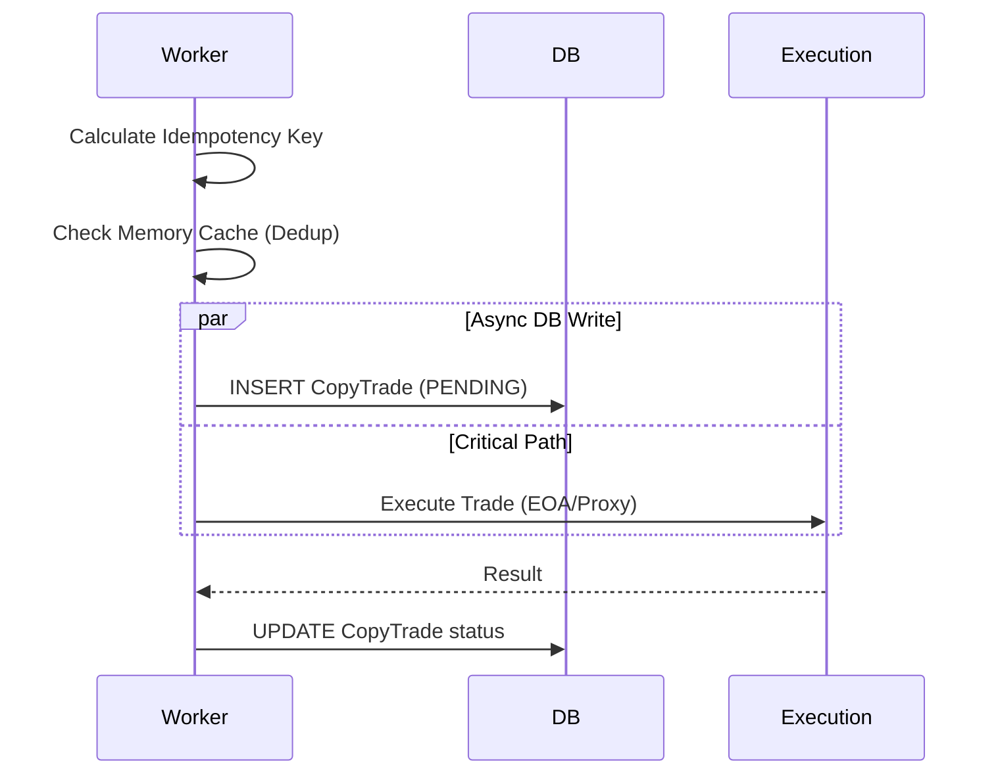

# Design: Optimize Database Performance

## 1. Async Prewrite (Fire-and-Forget)

### Problem
Currently, `prisma.copyTrade.create` blocks the execution pipeline for every candidate trade.
`timeStage('prewrite', ...)` is awaited.

### Solution
Move the database write out of the critical path.
1.  **Memory-First Idempotency**: Rely on `gate` (concurrency limiter) and `idempotencyKey` calculation to prevent duplicates in-memory during the brief window of execution.
2.  **Background Promise**: Launch the Prisma create operation without `await`.
3.  **Error Handling**: Append a `.catch()` handler to the background promise to log errors to console/monitoring, ensuring the worker doesn't crash on DB failure.

### Data Flow

## 2. Config Caching

### Problem
`refreshConfigs` queries Postgres every 60s for all active configs.

### Solution
Use `UnifiedCache` (in-memory) with a "Cache-Aside" or "Read-Through" pattern.
1.  **Key**: `copy-trading:configs:active`
2.  **TTL**: 10 seconds (Short TTL allows rapid updates from UI while protecting DB from tight loops if we increase frequency).
3.  **Implementation**: Wrap the `prisma.copyTradeConfig.findMany` call with `cache.getOrSet`.

### Invalidation
*   **Manual**: When a user updates their config via API (`PUT /api/copy-trading/config`), we should ideally invalidate this cache key.
*   **Worker**: Since the worker runs in a separate process from the Next.js API, they *do not share memory*.
    *   *Constraint*: In-memory cache in the Worker is isolated from the API.
    *   *Result*: API updates won't clear Worker cache immediately.
    *   *Acceptance*: A 60s polling interval (existing) or 10s cache TTL is acceptable latency for config updates. We will keep `refreshConfigs` loop but cache the DB result if we decide to run it more frequently, or just rely on the existing 60s loop.
    *   *Refinement*: The current `refreshConfigs` runs every 60s. This is already "cached" for 60s by virtue of the loop interval.
    *   *Optimization*: If we want *faster* reaction to config changes (e.g., user stops bot), we need *more frequent* polling (e.g. 5s). **To support 5s polling without hammering DB, we need the caching.** But wait, if we poll DB every 5s and cache for 10s, we are just reading cache.
    *   *Better Design*: Poll DB every 5s. Use `updatedAt` checking? Or just optimized query.
    *   *Decision*: For this iteration, we keep the simple loop but optimize the *query* if possible, or just accept that "optimization" here might primarily be about the **Async Prewrite**.
    *   *Correction*: The user request specifically mentioned "Prewrite" as a hotspot in my analysis. Config polling is less critical unless we increase frequency.
    *   **Revised Plan**: Focus heavily on Async Prewrite. For Configs, we will just ensure the query is lightweight (select only necessary fields, which is already done).

## 3. Database Indexes
Status: **Good**. `walletAddress`, `traderAddress`, `isActive` are indexed.
Action: Verify indices exist in DB (already done via `schema.prisma`). No action needed.
